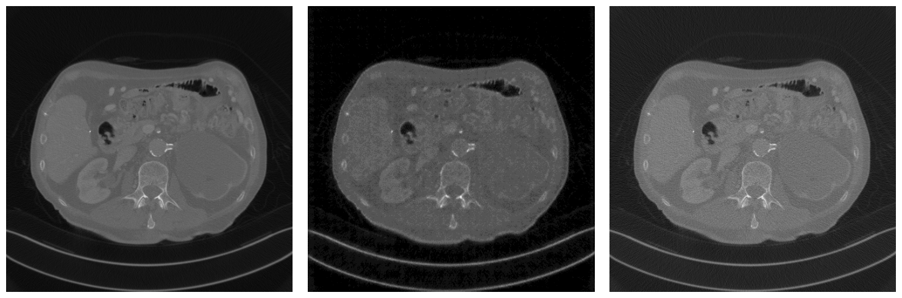
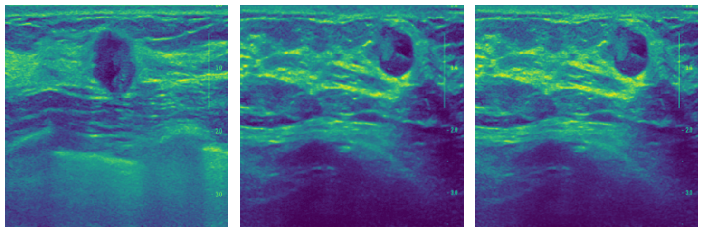

# Telegram Image Enhancement bot

This is the capstone project on DLS course part 1 (2025). The main idea of the project is to make a Telegram bot, which enhance medical images (CT or US images in particulary) quality via CycleGAN architecture.

bot link: https://t.me/medical_images_enhancement_bot

## Project motivation: 

Improving medical image quality is very important when using low-dose CT scans or old imaging devices. Poor-quality images can lead to noise and artifacts, making diagnosis more difficult. High-quality images help clinicians detect subtle abnormalities and reduce the risk of misdiagnosis, especially in early stages of disease.


## Project structure

```
telegram_bot/
├── bot.py
├── image_processing.py
├── image_handler.py
├── action_handler.py
├── config.py
├── model/
├── requirements.txt
├── Dockerfile
├── requirements.txt
├── Dockerfile
learning_notebooks/
├── DLS_project_training.ipynb
├── DLS_project_inference.ipynb
images/
README.md
```

## How to install

### Clone the repo

```bash
git clone git@github.com:djdjenny/medical_images_enchancement.git
cd medical_images_enchancement
```

### Install dependencies

directly
```bash
pip install -r requirements.txt
```

or use docker
```bash
docker build -t medical_enh_bot .
```

Due to the big model size, it should be downloaded from google drive and manually replaced to telegram-bot folder.

Bot is hosted on Hetzner VPS, HTTP endpoint obtained by ngrok.

Example of running command. Bot token is located in .env file and is automatically parsed.
```
docker run -d  -p 8443:8443  -e WEBHOOK_URL={ngrok url} --name {container_name} medical_enh_bot
```


# Model architecture and training

Main inspiration for this project was [CT denoising CycleGAN](https://github.com/taehoon-yoon/CT-denoising-using-CycleGAN/tree/master) model built for [AAPM challenge](https://www.aapm.org/).

I tried to recreate it with minor refactoring and apply the model to another dataset from 
[Ultrasound image enhancement challenge](https://ultrasoundenhance2023.grand-challenge.org/).

All models could be found on [google drive](https://drive.google.com/drive/folders/1EcLJOjIw0mHycejGZ0-z0TFJh8NEWkS_). 

One can find inference and training notebooks in the repo.

Example results for CT and US inference.
High-quality image, generated image, low-quality image




# Further work

For now, the main problem for the model is the big tendency to over-granulate the image, which is quite dangerous for the field.
I also want to expand variety of images which can be enhanced by the bot - various sizes, sources, etc.


# Contacts:

- telegram: @dj_djenny
- github: djdjenny